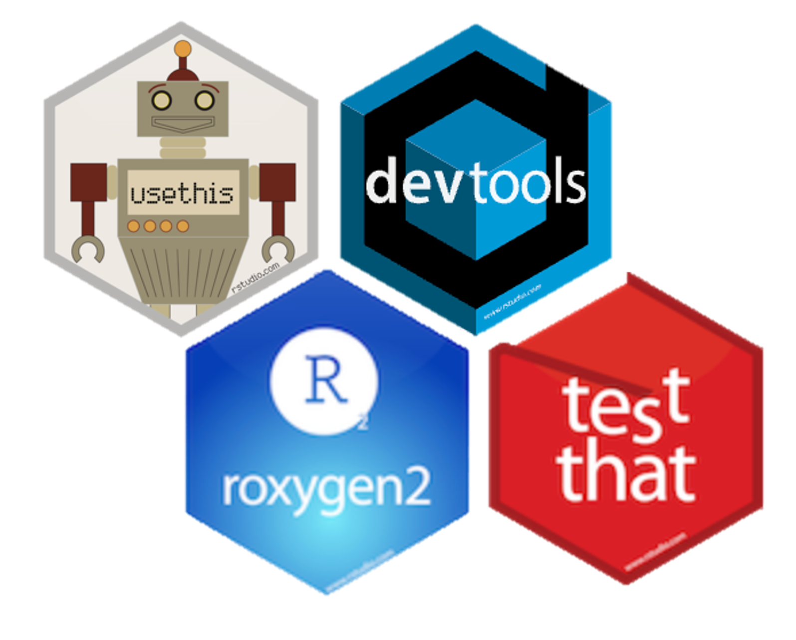
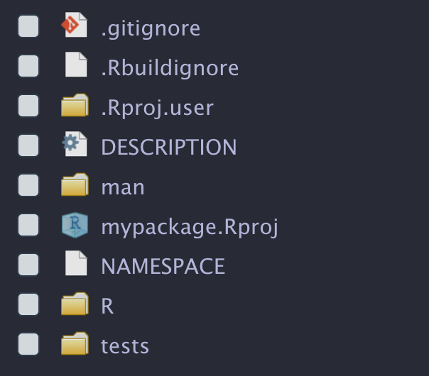
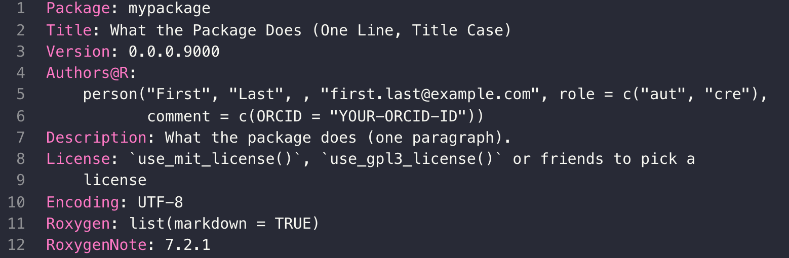

# R Package Development with {`usethis`}

## What is an R package?

-   a collection of R functions
-   available for you and others to use

### When should you make your functions into a package?

-   when you find yourself re-using a set of related functions
-   when you want to make your functions available to others

## Getting Started

{fig-align="center"}

## Creating a new R package

-   `File -> New Project -> New Directory -> R Package`
-   *or* `usethis::create_package()`

## R package components

{fig-align="center"}

## Writing a function for your package

-   use `usethis::use_r()` to create an Rscript in the `R/` directory

-   write your function

-   use `devtools::load_all()` to make your function available for interactive use (as if built, installed, and loaded in our package using `library()`)

-   use `devtools::check()` to make sure your function is working

## Edit `DESCRIPTION`

-   `DESCRIPTION` contains metadata about your package

-   Edit the fields that were pre-populated by `{usethis}`

{fig-align="center"}

-   You can also use `usethis::use_package()` to add packages to `DESCRIPTION` that your new package depends on

## Documenting your functions

-   to create documentation for our new function, we must have a `.Rd` file in the `man/` directory, written in a specific R markup language

-   this is made easy by a package called `roxygen2`

-   place cursor somewhere in your function then `Code -> insert roxygen skeleton` and fill in

-   then run `devtools::document()` to convert your `roxygen` code to an `.Rd` file in the `man/` directory.

## `NAMESPACE`

-   `devtools::document()` also updates the `NAMESPACE` file based on the `@export` tag in `roxygen` comments.

-   This makes your function available to users after using `library()` to load your package.

## Testing your functions

-   `usethis::use_testthat()` sets up the framework for formal unit testing

-   `usethis::use_test()` creates an Rscript in the `tests/` directory

-   write your test

-   formally run your tests by running `load_all()`, then `devtools::test()`

## Other {`usethis`} functions

-   `use_*_license()`
-   `use_git()`
-   `use_github()`
-   `use_github_actions()`
-   `use_readme()`

## Using and sharing your package

-   Build your package locally for personal use. (No back up or version control)
-   Make your package available using GitHub. (example: [zctaDB](https://github.com/geomarker-io/zctaDB))
-   Submit your package to CRAN.

## Learn More

-   [R Packages Online Book](https://r-pkgs.org/)
-   [This Blogpost](https://cosimameyer.com/post/understanding-the-basics-of-package-writing-in-r/) I used to outline this talk
-   [Package Dev Master Class](https://github.com/rstudio-conf-2022/pkg-dev-masterclass)
-   [usethis](https://usethis.r-lib.org/)
-   [devtools](https://devtools.r-lib.org/index.html)
